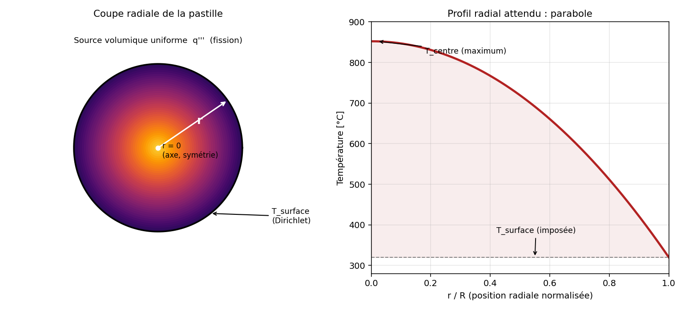
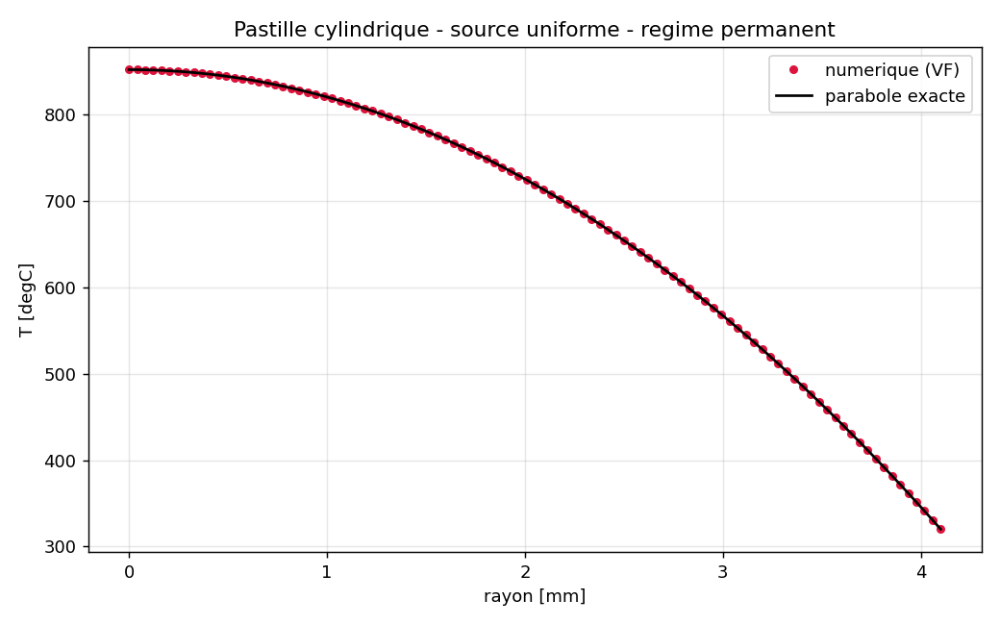

# Solveur thermique 1D radial : crayon combustible nucléaire

**Résolution de l'équation de la chaleur en coordonnées cylindriques par volumes finis, appliquée à une pastille de combustible UO₂.**

> Un crayon combustible chauffe par fission en son centre et évacue cette chaleur radialement vers le fluide caloporteur. Ce dépôt construit, étape par étape, un solveur qui calcule le profil de température `T(r)` dans la pastille. Cette v1 traite le cas le plus simple (cylindre plein, un seul matériau, propriétés constantes) et sert de brique de base validée avant complexification. Schéma de discrétisation : volumes finis vertex-centered + Crank-Nicolson. Résultat : accord avec la solution analytique à la précision machine.

---

## Sommaire

1. [Présentation du problème](#1-présentation-du-problème)
2. [Hypothèses simplificatrices](#2-hypothèses-simplificatrices)
3. [Méthodologie du code](#3-méthodologie-du-code)
4. [Résultats](#4-résultats)
5. [Points critiques](#5-points-critiques)
6. [Tests](#6-tests)
7. [Conclusion](#7-conclusion)

---

## 1. Présentation du problème

Dans un réacteur, la fission a lieu dans le volume du combustible (pastille d'UO₂) et dégage une puissance volumique `q'''`. Cette chaleur doit traverser la pastille par conduction radiale pour atteindre sa surface, en contact avec le jeu, la gaine, puis le fluide caloporteur. Le point le plus chaud du crayon se situe donc sur l'axe (`r = 0`), et la température décroît vers la périphérie.

  

*Gauche : coupe radiale, source de fission uniforme, symétrie sur l'axe, température imposée en surface. Droite : forme attendue du profil (parabole en régime permanent avec source uniforme).*

L'équation résolue est l'équation de la chaleur réduite à sa seule composante radiale (voir la note de calcul jointe, `coordonnees_cylindriques.tex`, pour la démonstration complète depuis $\nabla\cdot(k\nabla T)$ en 3D) :

$$\rho c_p \frac{\partial T}{\partial t} = \frac{1}{r}\frac{\partial}{\partial r}\left(r\,k\,\frac{\partial T}{\partial r}\right) + \dot q'''$$

avec, comme conditions aux limites :
- **au centre (`r = 0`)** : Via la symétrie, aucune condition à imposer explicitement (voir §3) ;
- **en surface (`r = R`)** : température imposée `T_surface` (Dirichlet).

---

## 2. Hypothèses simplificatrices

Cette v1 est volontairement le cas le plus dépouillé possible, pour valider le cœur du schéma numérique avant d'ajouter de la complexité physique dans les versions suivantes :

| # | Hypothèse | Portée |
|---|-----------|--------|
| 1 | **Axisymétrie + invariance axiale** | Le problème 3D $(r,\theta,z)$ se réduit à 1D radial pur : pas de gradient en $\theta$ (symétrie de révolution) ni en $z$ (loin des extrémités, flux de fission supposé localement uniforme). |
| 2 | **Monomatériau** | Pastille pleine d'UO₂ homogène et pas de jeu, pas de gaine (ajoutés dans les versions suivantes). |
| 3 | **Propriétés constantes** | $k$, $\rho c_p$ indépendants de $T$. |
| 4 | **Source volumique uniforme (cas de référence)** | $\dot q'''$ constant dans le rayon pour le cas de validation principal ; le solveur accepte cependant un profil `source(r)` arbitraire (exploité par le test de convergence, §6). |
| 5 | **Dirichlet en surface** | La température de surface est imposée directement, sans modéliser l'échange convectif avec le fluide caloporteur (pas de coefficient d'échange `h`). |
| 6 | **Pas d'évolution géométrique** | Ni gonflement du combustible, ni fissuration, ni relocalisation : la géométrie reste figée dans le temps. |

---

## 3. Méthodologie du code

**Discrétisation spatiale : volumes finis vertex-centered.** Chaque nœud `i` porte une cellule de contrôle `[r_{i-1/2}, r_{i+1/2}]`. L'équation est intégrée sur ce volume de contrôle plutôt que discrétisée terme à terme : c'est cette intégration qui fait apparaître naturellement les aires de face $A_{i\pm1/2} = 2\pi r_{i\pm1/2}$ et les volumes $V_i = 2\pi r_i \Delta r$, et qui simplifie analytiquement le terme en $1/r$ *avant* toute évaluation numérique (démonstration détaillée dans la note jointe).

**Traitement du centre : pas de cas particulier codé.** Le nœud central est un disque plein (`V_0 = π(Δr/2)²`) dont la face interne a une aire nulle (`A_{-1/2} = 2π·0 = 0`). La condition de symétrie n'est donc pas *imposée* : elle **émerge** de la géométrie, puisque tout flux entrant par cette face est multiplié par une aire nulle.

**Discrétisation temporelle : Crank-Nicolson.** Schéma semi-implicite d'ordre 2 en temps, inconditionnellement stable (permet des pas de temps `dt` agressifs sans perte de stabilité, testé jusqu'à `dt = 1 s`).

**Structure algébrique.** Le problème étant linéaire à `k` uniforme, la matrice tridiagonale du système ne dépend pas du temps : elle est assemblée **une seule fois** dans `__init__` (méthode `_construire_matrice`), puis réutilisée à chaque pas ainsi seul le second membre `b` est recalculé dans `step()`. La résolution du système tridiagonal se fait en `O(N)` via `scipy.linalg.solve_banded`, au lieu d'une inversion dense en `O(N³)`.

**API minimale.** `PastilleV1(alpha, k_th, R, N, dt, T_surface, T_init, source)` puis `.step()` / `.solve(n_steps)` ; historique de température conservé pour post-traitement (`get_historique()`), diagnostic de bilan de puissance disponible via `flux_sortant_frontiere()`.

---

## 4. Résultats

Cas de validation : pastille UO₂ (`R = 4,1 mm`, `k = 3 W/(m·K)`), source de fission `q''' = 3,8×10⁸ W/m³` (ordre de grandeur REP), `T_surface = 320 °C`. En régime permanent, la solution analytique est une parabole exacte :

$$T(r) = T_{surface} + \frac{\dot q'''}{4k}\left(R^2 - r^2\right)$$

  

| Grandeur | Valeur |
|---|---|
| T centre — numérique | 852,3167 °C |
| T centre — analytique | 852,3167 °C |
| Erreur max sur tout le profil | 2,6 × 10⁻¹² °C (précision machine) |
| Puissance générée (bilan) | 19 867,69 W/m |
| Puissance sortante (dernière face) | 19 867,69 W/m |
| Écart relatif du bilan de puissance | 1,5 × 10⁻¹⁵ |

L'accord à la précision machine (et non à une tolérance d'ingénieur du type 10⁻³) confirme que le schéma discret représente exactement une solution parabolique : cohérent avec le fait qu'un stencil centré d'ordre 2 est exact sur les polynômes de degré ≤ 2. Le bilan de puissance est conservé à l'arrondi machine près, propriété attendue d'un schéma volumes finis correctement construit (flux téléscopique entre cellules voisines).

---

## 5. Points critiques

Ce que ce modèle **ne** capture **pas** :

- **Dirichlet en surface = hypothèse forte.** Imposer directement `T_surface` court-circuite la physique de l'échange gaine/caloporteur (coefficient d'échange convectif `h`). En réalité `T_surface` résulte elle-même d'un bilan thermique côté fluide : ce n'est pas une donnée d'entrée libre.
- **Conductivité constante.** Pour l'UO₂, `k(T)` chute fortement avec la température. La considérer constante ici **sous-estime la résistance thermique réelle du combustible** et donc le `ΔT` centre-surface en conditions réalistes de fonctionnement.
- **Monomatériau.** L'absence du jeu combustible-gaine (résistance de contact/conduction gazeuse, souvent le saut de température le plus significatif du crayon) et de la gaine elle-même signifie que cette v1 ne représente qu'une fraction du `ΔT` total réel du crayon.
- **Pas de couplage 2D/3D.** L'hypothèse d'invariance axiale ignore les effets de bord (extrémités du crayon, grilles de maintien) et un éventuel profil de puissance axial non plat : réalistes sur un crayon REP.
- **Pas de propriétés dépendantes de l'irradiation.** Pas de prise en compte du gonflement, de la fissuration radiale du combustible ni de la dégradation de conductivité.
- **Précision non quantifiée en régime transitoire.** Aucun test ne vérifie la précision du solveur en cours de transitoire : seules la non-divergence (stabilité) et la justesse du résultat final à l'équilibre sont couvertes.

---

## 6. Tests

Suite de 13 tests (`pytest test_pastille_v1.py -v`) : **13/13 passés**.

| Test | Ce qu'il vérifie |
|---|---|
| `test_bord_dirichlet` | La condition de surface reste tenue exactement après intégration temporelle. |
| `test_stabilite_bornee` | Stabilité inconditionnelle de Crank-Nicolson même avec `dt` agressif (`dt = 1 s`). |
| `test_isotherme_sans_source` | Sans source, un état initial uniforme reste uniforme (équilibre trivial). |
| `test_centre_maximum_temperature` | Le centre est bien le point le plus chaud, profil strictement décroissant : la symétrie émerge sans être codée en dur. |
| `test_parabole_regime_permanent` | Validation quantitative forte : accord avec la parabole analytique à mieux que 0,5 °C. |
| `test_pas_de_singularite_au_centre` | Aucun NaN/Inf au nœud central, pour plusieurs résolutions de maillage. |
| `test_bilan_energie_regime_permanent` | Conservation de l'énergie : puissance générée = puissance sortante, à 10⁻³ près. |
| `test_source_nulle_equivaut_none` | Rétrocompatibilité : `source=None` ≡ `source=0`. |
| `test_stabilite_plusieurs_maillages` *(×4)* | Robustesse sur 4 résolutions (N = 21 à 201). |
| `test_convergence_maillage` | Convergence en `O(Δr²)` sur un cas à solution polynomiale de degré 4 (source non uniforme) : le ratio d'erreur mesuré entre `N=51` et `N=101` est bien compris entre 3 et 5. |

---

## 7. Conclusion

Cette v1 démontre, sur un cas où une solution analytique exacte existe, la solidité du cœur numérique du solveur (schéma volumes finis, traitement géométrique du centre, conservation de l'énergie, ordre de convergence). C'est sur cette base validée que s'appuient les versions suivantes pour lever les hypothèses simplificatrices listées en §5.
